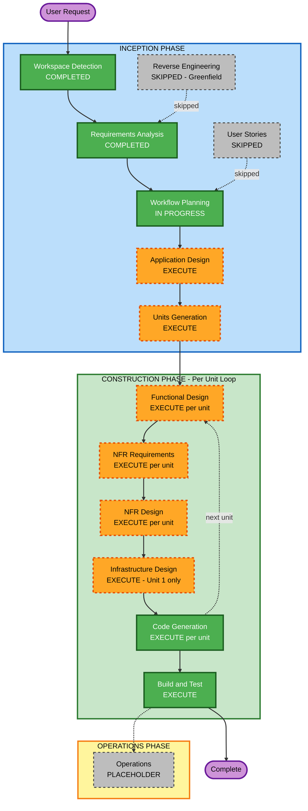

# Execution Plan — llmonitor LLM Proxy

## Detailed Analysis Summary

### Change Impact Assessment

| Impact Area | Present | Description |
|---|---|---|
| User-facing changes | Yes | New system — React frontend, OpenAI-compatible API for client integrations |
| Structural changes | Yes | Multi-component architecture: Rust proxy core, provider abstraction layer, analytics engine, management API, React SPA |
| Data model changes | Yes | New SQLite schema: request records, session aggregates, configuration store |
| API changes | Yes | New public API surface: OpenAI-compatible `/v1/*`, management `/api/*`, metrics `/metrics` |
| NFR impact | Yes | Performance (async persistence, <10ms overhead), Security (15 rules enforced), Observability (structured logging, Prometheus) |

### Risk Assessment

| Attribute | Assessment |
|---|---|
| **Risk Level** | Medium |
| **Rationale** | New greenfield system with well-defined requirements; Rust's type system reduces runtime errors; main risk is provider translation correctness and SQLite async write performance |
| **Rollback Complexity** | N/A (greenfield) |
| **Testing Complexity** | Moderate — provider integration requires live API or mocked Anthropic responses; SQLite write throughput needs benchmarking |

---

## Workflow Visualization

### Mermaid Diagram



### Text Alternative

```
INCEPTION PHASE:
  [DONE]    Workspace Detection
  [SKIP]    Reverse Engineering  — greenfield, no existing code
  [DONE]    Requirements Analysis
  [SKIP]    User Stories         — technical system, clear requirements, no multi-persona UX
  [ACTIVE]  Workflow Planning
  [EXECUTE] Application Design   — new multi-component system needs component boundaries + Provider trait design
  [EXECUTE] Units Generation     — 6 distinct units of work identified

CONSTRUCTION PHASE (Per-Unit Loop x6):
  [EXECUTE] Functional Design    — new data models, session ID algorithm, OpenAI<->Anthropic translation
  [EXECUTE] NFR Requirements     — performance, security (15 rules), observability
  [EXECUTE] NFR Design           — rate limiting, structured logging, security middleware patterns
  [EXECUTE] Infrastructure Design — Docker, SQLite volume, port config (Unit 1 only; subsequent units reference)
  [EXECUTE] Code Generation      — full implementation per unit
  [EXECUTE] Build and Test       — build instructions, unit tests, integration tests

OPERATIONS PHASE:
  [PLACEHOLDER] Operations
```

---

## Phases to Execute

### INCEPTION PHASE

- [x] Workspace Detection — COMPLETED
- [x] Reverse Engineering — SKIPPED (greenfield project, no existing code)
- [x] Requirements Analysis — COMPLETED
- [ ] User Stories — SKIPPED
  - **Rationale**: Single-developer technical tool with clear, well-defined requirements. No multiple conflicting user personas or UX acceptance criteria needed. Requirements document is sufficient.
- [x] Workflow Planning — IN PROGRESS
- [ ] Application Design — EXECUTE
  - **Rationale**: New system with 6 distinct components requiring defined boundaries, a `Provider` trait interface, data flow architecture, and component dependency map before units can be decomposed.
- [ ] Units Generation — EXECUTE
  - **Rationale**: 6 discrete units of work identified with different technology domains (Rust core, provider adapter, persistence, analytics, config management, React frontend). Decomposition guides parallel development and stage sequencing.

### CONSTRUCTION PHASE (Per-Unit Loop)

- [ ] Functional Design — EXECUTE (per unit)
  - **Rationale**: New SQLite schema design, session ID derivation algorithm, OpenAI↔Anthropic request/response translation mapping, Prometheus metric definitions all require detailed functional design.
- [ ] NFR Requirements — EXECUTE (per unit)
  - **Rationale**: Explicit performance target (<10ms overhead), 15 security rules enforced (blocking), async persistence design, rate limiting, structured logging all require NFR specification per unit.
- [ ] NFR Design — EXECUTE (per unit)
  - **Rationale**: NFR patterns must be embedded: Tokio async tasks for DB writes, Axum middleware stack (auth, rate-limit, security headers, request ID), Argon2 password hashing, parameterized queries via sqlx.
- [ ] Infrastructure Design — EXECUTE (Unit 1 only, referenced by subsequent units)
  - **Rationale**: Docker multi-stage build, SQLite volume mount, port configuration, environment variable schema defined once for the whole system at Unit 1.
- [ ] Code Generation — EXECUTE (per unit, always)
- [ ] Build and Test — EXECUTE (always, after all units complete)

### OPERATIONS PHASE

- [ ] Operations — PLACEHOLDER

---

## Proposed Unit Breakdown

| Unit | Name | Description | Primary Technologies |
|---|---|---|---|
| 1 | Proxy Core | Axum HTTP server, OpenAI-compatible API schema, request routing pipeline, middleware stack, static asset serving | Rust, Axum, Tokio, serde |
| 2 | Claude Provider Adapter | Anthropic Messages API client, OpenAI↔Anthropic translation, prompt cache tracking, streaming | Rust, reqwest, Anthropic API |
| 3 | Token Tracking & Session Engine | SQLite schema, async write pipeline, session ID derivation (conversation hash), request record persistence | Rust, sqlx, SQLite, sha2 |
| 4 | Statistics & Prometheus Metrics | Rolling window aggregation queries, statistics REST API endpoints, Prometheus metrics exposition | Rust, sqlx, prometheus crate |
| 5 | Configuration Management | Config CRUD API, basic auth middleware (Argon2), admin credential bootstrap, DB-backed config store | Rust, Argon2, sqlx |
| 6 | React Frontend | TypeScript + React SPA, Vite build, analytics dashboard, cache analytics, configuration UI | TypeScript, React, Vite |

---

## Success Criteria

- **Primary Goal**: A working LLM proxy that transparently handles OpenAI-format requests to Claude, persists all token usage, and exposes analytics
- **Key Deliverables**:
  - Rust binary implementing the full proxy + API surface
  - React frontend with analytics dashboard and configuration UI
  - SQLite database schema with migrations
  - Docker container (multi-stage build)
  - Prometheus metrics endpoint
  - Comprehensive test suite (unit + integration)
  - Build and deployment instructions
- **Quality Gates**:
  - All 15 Security Baseline rules compliant at each construction stage
  - Property-based tests for session ID derivation and OpenAI↔Anthropic translation
  - Integration tests verify end-to-end request flow (mock Anthropic upstream)
  - Docker build produces working container
